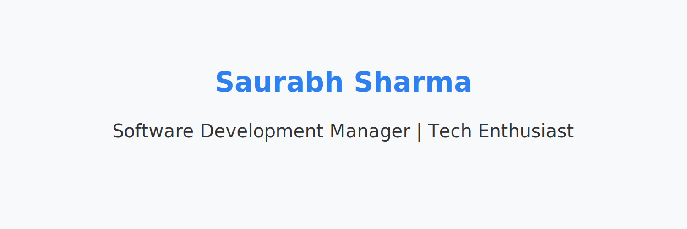
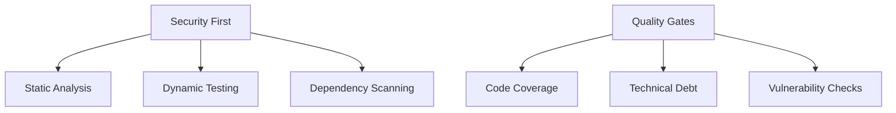

# Engineering Leader & Java Architect 👨‍💻

<div align="center">
  
</div>

## About Me 🎯

Engineering Manager with 20+ years of experience in software development and team leadership. Specialized in Java enterprise architecture, DevSecOps practices, and building high-performing engineering teams. Security champion with expertise in implementing robust security practices and quality assurance frameworks.

### Current Focus 💡

```typescript
const engineeringManager = {
    leadership: {
        teams: ['Java Development', 'Cloud Infrastructure'],
        practices: ['Agile', 'DevSecOps', 'Quality-First'],
        focus: ['Team Growth', 'Technical Excellence']
    },
    security: {
        role: 'Security Champion',
        expertise: ['Vulnerability Management', 'Security Automation'],
        tools: ['SAST', 'DAST', 'SCA']
    },
    technical: {
        primary: ['Java', 'Spring', 'AWS', 'Ansible'],
        architecture: ['Microservices', 'Cloud-Native', 'Event-Driven'],
        automation: ['CI/CD', 'IaC', 'Test Automation']
    }
};
```

## Technical Leadership 🛠️

<div align="center">

| Java Enterprise | Spring Framework | AWS Cloud | DevOps |
|:-:|:-:|:-:|:-:|
| ☕ | 🍃 | ☁️ | ⚙️ |

</div>

## Security & Quality Focus 🛡️



## Engineering Metrics 📊

<div align="center">

| Code Quality | Security Score | Performance Index |
|:-:|:-:|:-:|
| 95% ✨ | A+ 🔒 | 99.9% ⚡ |

</div>

## Latest Articles 📝

<!-- BLOG-POST-LIST:START -->
<!-- This section is automatically updated by GitHub Actions -->
<!-- BLOG-POST-LIST:END -->

## Areas of Expertise 🎯

| Area | Expertise |
|:--|:--|
| 👥 | Engineering Team Leadership & Mentoring |
| 🛡️ | Security & Quality Assurance |
| 🗺️ | Release Planning & Roadmap Development |
| 🏗️ | Technical Architecture & System Design |
| ♾️ | DevSecOps & Automation |

## Let's Connect 🤝

<div align="center">

[](https://linkedin.com/in/samarthyasaurabh)
[](https://twitter.com/PahadiPandit)
[](https://blog.samarthya.me)

</div>

---

<div align="center">
  <sub>Built with ❤️ using GitHub-native features</sub>
</div>